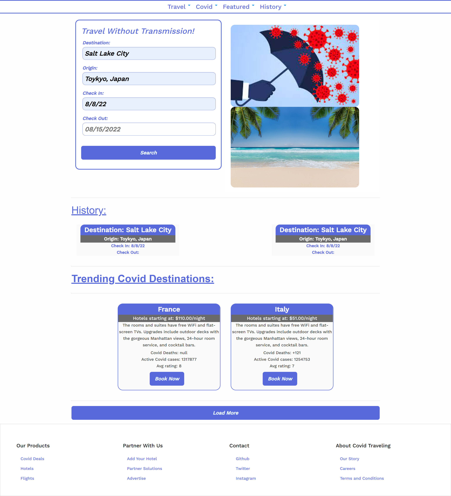

# Covid Travling Guide

<!-- PROJECT LOGO -->
 

  <h3 align="center"> Covid Travling Guide </h3>

  

    Created 7/21/2022
  

<!-- TABLE OF CONTENTS -->

  
Table of Contents

  <ol>
    <li>
      <a href="#about-the-project">About The Project</a>
      <ul>
        <li><a href="#built-with">Built With</a></li>
      </ul>
    </li>
    <li><a href= "Actually about our project">The real about section!</a></li> 
    <li><a href="#contact">Contact</a></li>
    <li><a href="#acknowledgments">Acknowledgments</a></li>        
  </ol>

<!-- ABOUT THE PROJECT -->
## About The Project

The current traveling climate comes with many new tools and challenges to overcome many global problems.  Coronavirus is a major concern to many travelers looking to not get sick and spread illness to their loved ones while still also enjoying a vacation.  It is now very common to travel some where and not know or understand the risk involved at a new location therefore, we have created a website where you can search a location and get information about local coivd statistics and cost of travel and stay in area.  Having the ability to have detailed information all in one place and easily accessible

Worked with fellow students to create a collaborative work. Each member of the group shared thier skills and knowledge and leaning on each others strengths to create this web application.  Used constant communication and time management ot organise meeting times and divide tasks.

(<a href="#top">back to top</a>)

# Actually about our project

Through blood, sweat and mostly tears. THIS is our project that we have so painstakingly created. A (mostly) functional website to give users general price & Covid information about locations they may want to travel to.
* Heres what it does
  * When opening the website the user will be greeted with our magnificent front end hand crafted by founda.... I mean us! This will include pictures and short descriptions of some popular locations
  * Options, we here at groupName strongly belive that the end-user should be able to self-actualize their own traveling parameters to their very hearts extent. They will be able to determine a large array of factors they would like such as 
    * Determine which Covid rates & local guidelines they would like 
    * When they will be arriving to and departing from the location of their choice
    * Their choice of Available hotels, rooms, rental cars, flights, donuts
    * As well as determine which ratings are acceptable for for all of the above!

### Built **With**

* [VScode]
* [HTML]
* [CSS]
* [JavaScript]
* [Foundation]
* [Github]
* [Moment.js]
* [Priceline-API]
* [Covid-19-API]

(<a href="#top">back to top</a>)

<!-- CONTACT -->
## Contact

* Lucas Freigenberg -- lsfreigenberg@outlook.com
* James Hampton -- jimmy.hampton@outlook.com
* Zachry Jorgensen -- z.d.jorgensen@gmail.com 

Project Link: 

(<a href="#top">back to top</a>)

<!-- ACKNOWLEDGMENTS -->
## Acknowledgments
These resources helped us greatly and gave us different perspectives on how to complete the project.

* [MDN](https://developer.mozilla.org/en-US/)
* [Foundation docs](https://get.foundation/sites/docs/)
* [Priceline](https://www.priceline.com)

(<a href="#top">back to top</a>)

